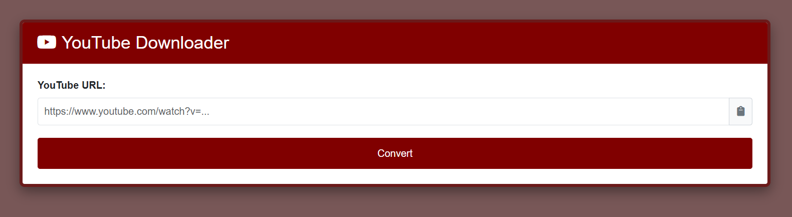
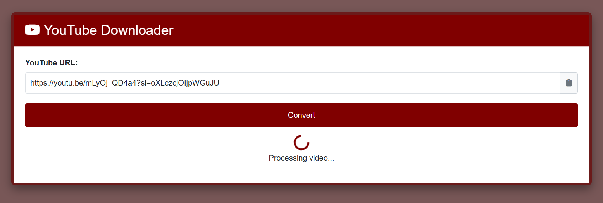
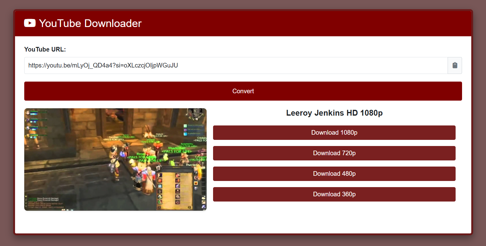

# (Youtubedl) YouTube Downloader Web App Installation Guide
Self-hosted web GUI for yt-dlp . Youtube URL MP4 downloader

## Overview
This web application allows users to download YouTube videos in various quality formats through a browser interface. It uses Flask as the web server, connects to YouTube for video information, and uses yt-dlp and ffmpeg to download and process videos.

## Deployment Steps

### 1. Prepare Environment

```bash
# Create directory for the application
mkdir -p /volume/youtubedl
cd /volume/youtubedl

# Create virtual environment
python3 -m venv venv
```

### 2. Install Dependencies

```bash
# Activate virtual environment
source venv/bin/activate

# Install dependencies
pip install flask
pip install --upgrade yt-dlp

# Install FFmpeg (system package)
# Debian/Ubuntu:
apt-get install ffmpeg

# CentOS/RHEL:
yum install ffmpeg

# Alpine:
apk add ffmpeg
```

### 3. Create Application Files

Copy the provided files to their proper locations:
- `youtubedl.py` → `/volume/youtubedl/youtubedl.py`
- `youtubedl.html` → `/volume/youtubedl/youtubedl.html`
- `youtubedl.sh` → `/volume/youtubedl/youtubedl.sh`

### 4. Set Permissions

```bash
# Make the scripts executable
chmod +x /volume/youtubedl/youtubedl.py
chmod +x /volume/youtubedl/youtubedl.sh

# Create download directories
mkdir -p /volume/youtubedl/downloads
mkdir -p /volume/youtubedl/downloads/temp

# Set proper ownership (replace "your_username" with your actual username)
chown -R your_username:your_group /volume/youtubedl
```

### 5. Configure Service Script

Edit `youtubedl.sh` to set the correct username:
```bash
# Replace "user" with your actual username
USER="your_username"
```

Optionally, create a system service file for automatic startup:
```bash
# For systemd-based systems, create a service file
sudo nano /etc/systemd/system/youtubedl.service
```

Add the following content:
```
[Unit]
Description=YouTube Downloader Service
After=network.target

[Service]
Type=simple
User=your_username
WorkingDirectory=/volume/youtubedl
ExecStart=/volume/youtubedl/venv/bin/python /volume/youtubedl/youtubedl.py
Restart=on-failure

[Install]
WantedBy=multi-user.target
```

### 6. Set Up Service for NAS Systems (Optional)

For Synology or other NAS systems, install as a service:
```bash
# Copy the service script to startup location
sudo cp /volume/youtubedl/youtubedl.sh /usr/local/etc/rc.d/

# Make it executable
sudo chmod +x /usr/local/etc/rc.d/youtubedl.sh
```

### 7. Start the Application

#### Option A: Run directly
```bash
cd /volume/youtubedl
./youtubedl.sh start
```

#### Option B: Run as a system service (systemd)
```bash
# Enable and start the service
sudo systemctl enable youtubedl.service
sudo systemctl start youtubedl.service
```

#### Option C: Run as a NAS service
```bash
# Start the service
sudo /usr/local/etc/rc.d/youtubedl.sh start

# Stop the service
sudo /usr/local/etc/rc.d/youtubedl.sh stop

# Check status
sudo /usr/local/etc/rc.d/youtubedl.sh status

# View debug information
sudo /usr/local/etc/rc.d/youtubedl.sh debug

# Clean downloads older than 7 days
sudo /usr/local/etc/rc.d/youtubedl.sh clean
```

### 8. Access the Web Interface

Open a browser and navigate to:
```
http://your_server_ip:6776
```

## Important Notes
- Make sure port 6776 is open in your firewall
- The application logs are stored in `/var/log/youtubedl.log`
- Downloaded files are stored in `/volume/youtubedl/downloads`
- FFmpeg must be installed for video processing and conversion
- View logs in real-time with: `tail -f /var/log/youtubedl.log`
- The web interface has no authentication - consider using a reverse proxy with authentication for public deployments
- This tool is intended for personal use with content you have the right to download
- Use the debug command to troubleshoot issues: `sudo ./youtubedl.sh debug`
- To update yt-dlp: `source /volume/youtubedl/venv/bin/activate && pip install --upgrade yt-dlp`

## Screenshots




